## Intro
Summarising activities that happened between January and December of a year feels just as arbitrary as doing so for activities that happened between April and March. Using April-March, i.e., following the Indian Financial Year calendar, gives us two interesting benefits - we can use the annual report as the basis of the report that we need to file with the Indian Government Ministry of Corporate Affairs, and it sort of overlaps with the Indian Academic Year (July-May). So, going forward, we will continue to use April - March for our annual reports, and when you see us referring to 2025 in this report, we mean April 2025 - March 2026.

2025 was an interesting year for the FOSS United Foundation. We celebrated five years of FOSS United, and all of our experiments and community building started revealing patterns. For the first five years of our life, we were doing what we thought the community needed, and we focused on addressing what the community specifically asked us to do. This meant organising events, starting new FOSS communities across the country in the form of city communities or student clubs, and running IndiaFOSS and FOSS Hack. But over the past year, we started understanding what the community needs, instead of what they want. This is usually referred to as the XY Problem, i.e., the community needs X, but they ask for Y instead. We also started understanding the incentive structures that push the community to do what they do, e.g., our higher education system and college hiring push students to rack up Positions of Responsibility (PoR) instead of doing deep work. Why is this important? Because last year was also the year when we realised that a lot of our work was firefighting, e.g., untangling an awkward situation at a CityFOSS conference across multiple weeks, and we wanted to move from addressing the symptoms of the problem to addressing the root causes.

In this annual report, I will try my best to lay out our work during 2025 and how it helped us gain a deeper understanding of what the Indian FOSS community needs from us. And just to be clear, we are just one of the many FOSS, Free Software, and Open Source Software communities in India. Luckily, we happen to be one of the most funded and, institutionally, we are a younger organisation than most.

## Vision
The Indian FOSS & Digital Commons communities shape international discourse around FOSS & the Digital Commons.

That's a grand vision, but how do we realise it? Not-for-profit organisations are mission-driven, and our mission is to support and promote the Indian FOSS & Digital Commons ecosystems. But that's a broad mission statement. Over the past year, we have been able to refine it as follows -

## Mission
FOSS United Foundation supports and promotes the Indian FOSS ecosystem. We bring new people into existing communities, and we support the people already in the communities to sustain themselves. We incubate new communities when and where they are needed, and enable existing communities to thrive. We work with the industry to publicly acknowledge their usage of FOSS and help them support the Indian FOSS ecosystem. We do this by organising events, providing grants, and campaigning for public policy changes.

## Programs at FOSS United
Three distinct principal components emerge when you look at the mission statement - individuals, communities, and organisations - and three kinds of mini missions can be observed: bring new people into the ecosystem, help those already in the ecosystem to sustain themselves, and campaign for institutional support of the ecosystem. These three mini missions form the core of our Programs at FOSS United. A Programme or Program is a structured, funded initiative designed to solve a specific issue, and the "impact" of the Program can be measured in various ways. Therefore, we end up with three Programs at FOSS United - the Learners Program, the Maintainers Program, and the Campaigns Program. And it's incredible that all of our work already fits neatly into an overlap of these Programs.

If you are not aware, the FOSS United Foundation has carried out the following activities over our first five years

- IndiaFOSS annual festival, held in Bengaluru. The conference brings together technologists, designers, policy professionals, and more. It is a welcoming space both for young and inexperienced students and for old and experienced maintainers and creators.
- FOSS Hack annual hackathon, organized in a hybrid format. The hackathon brings together students and professionals from across the country to create new FOSS projects and to contribute to existing FOSS projects. In the most recent edition of the hackathon, the scope of the hackathon expanded from FOSS projects to Digital Commons projects, e.g., mapping, documentation, design, and other forms of contributions.
- Grants to financially support the creation of new FOSS. Broadly speaking, only a privileged few create and maintain FOSS, which unfortunately reduces the breadth of problems solved by the FOSS. By financially supporting people to create and maintain FOSS, we are enabling a wider variety of problems to be solved.
- City communities, incubated across the country. Usually formed with some form of support from the Foundation staff, the communities are usually made up of volunteers and organise events in the city to evangelise FOSS.
- Student clubs, organised across the country. With active support from the Foundation, student clubs evangelise FOSS within their college, and attempt to create new or contribute to existing FOSS projects. The clubs are degree- and department-agnostic to enable multi- and transdisciplinary work from the clubs.
- Public (Tech) policy awareness, primarily among creators and maintainers of FOSS. The Indian FOSS ecosystem is dictated by incentive structures that are unfortunately not visible to most of the people. Through our public (tech) policy work, we help the ecosystem develop a basic understanding of public (tech) policy, so that the ecosystem can advocate for policies that enable the sustenance of our ecosystem.
- Campaigns, aimed primarily towards the broader Software and Tech ecosystems. Practically every Indian software developer uses FOSS, but, unfortunately, most of them are unable to name an Indian FOSS creator or maintainer, and are unable to name prominent FOSS projects that are created and maintained from India. Our campaigns aim to change the cultural perception among young and inexperienced students and software developers, so that they recognise how India runs on FOSS, and who creates and maintains world-class FOSS from India.

Now, let's see how this work fits into the Programs I listed above - Learners Program, Maintainers Program, Campaigns Program.

- The Learners Program aims to build autonomy and agency within individuals, and the program helps the ecosystem develop a common, shared, foundational understanding of FOSS. To achieve this, the Learner Program works with the "uninitiated", i.e., college students, via Student Clubs, and professionals via city communities. The Program focuses on evangelising FOSS to help people understand the value of FOSS. The Program works with individuals, communities, and organisations.
- The Maintainers Program works to create a sustainable FOSS ecosystem, and the program helps the ecosystem fund, nurture, and support individuals who can provide the necessary care to the FOSS projects. To achieve this, the Maintainers Program works with the "initiated", i.e., contributors, maintainers, and creators of FOSS, irrespective of their age, experience, educational or professional background. The Program focuses on building capacity and enables knowledge sharing, to help creators and maintainers sustain FOSS. The Program works with individuals, communities, and organizations.
- The Campaigns Program attempts to shift the cultural perception of FOSS, and the program makes FOSS & the Digital Commons accessible.

## Learners Program

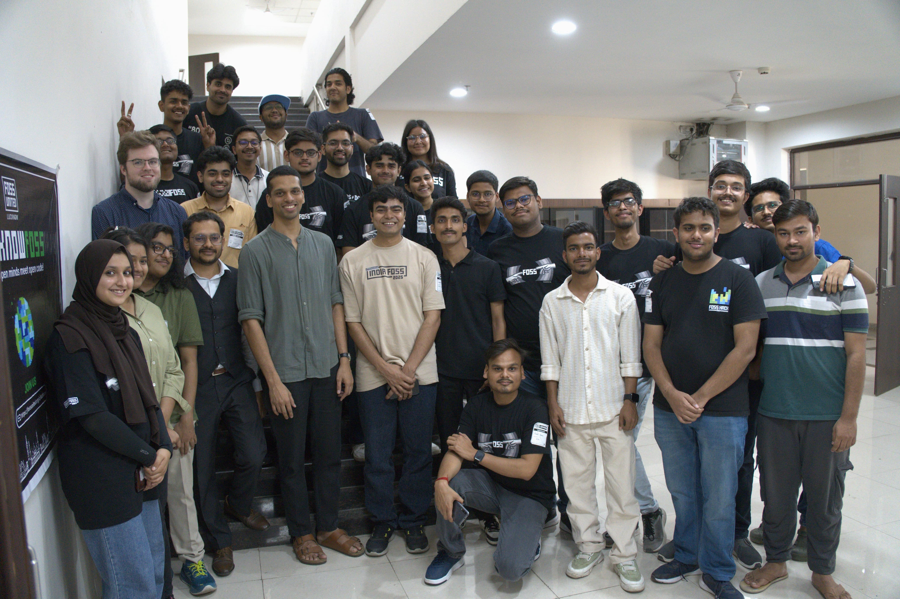

The Learners Program supports existing FOSS communities and incubates new communities when and where needed. City Community and Student Club activities are now consolidated under the Learners Program. All of the staff work on IndiaFOSS and FOSS Hack, but the Learners Program coordinates the effort going forward. Finally, a few grants are also evaluated in consultation with the Learners Program.

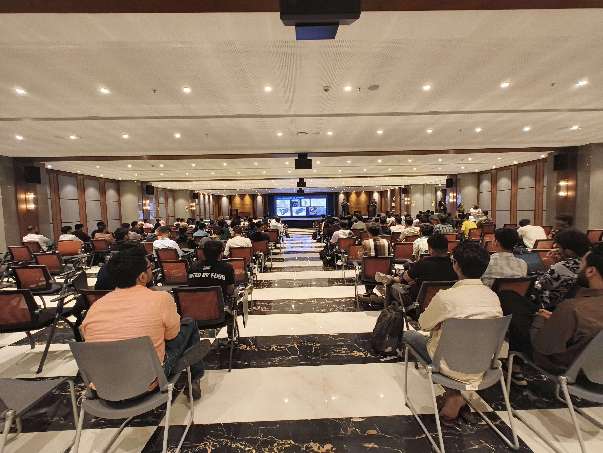

Vishal led the Learners Program as the Program Director. For a full list of events organized by
the FOSS United Foundation and Community in 2025, please see Appendix-A. For information on
events organized by FOSS Clubs, please see Appendix-B.

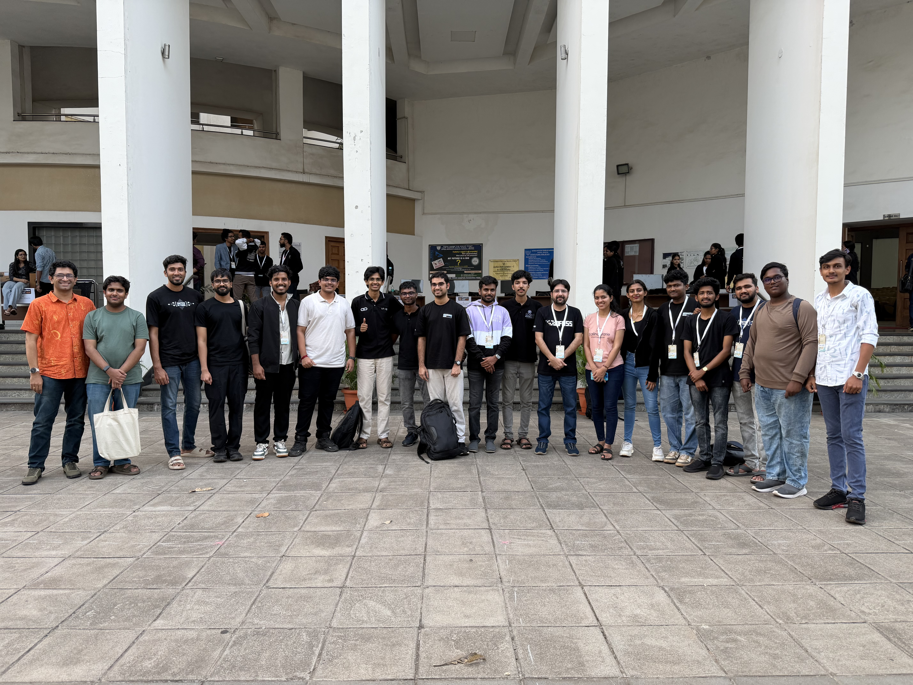

First Commit with Gagandeep Singh, Abhinav Raut, Sreelakshmi Jayarajan. The First Commit series was started in 2021. To highlight first FOSS & Digital Commons contributions by active contributors and maintainers. The virtual calls enabled participants to interact with the speakers to understand different perspectives on FOSS contributions.

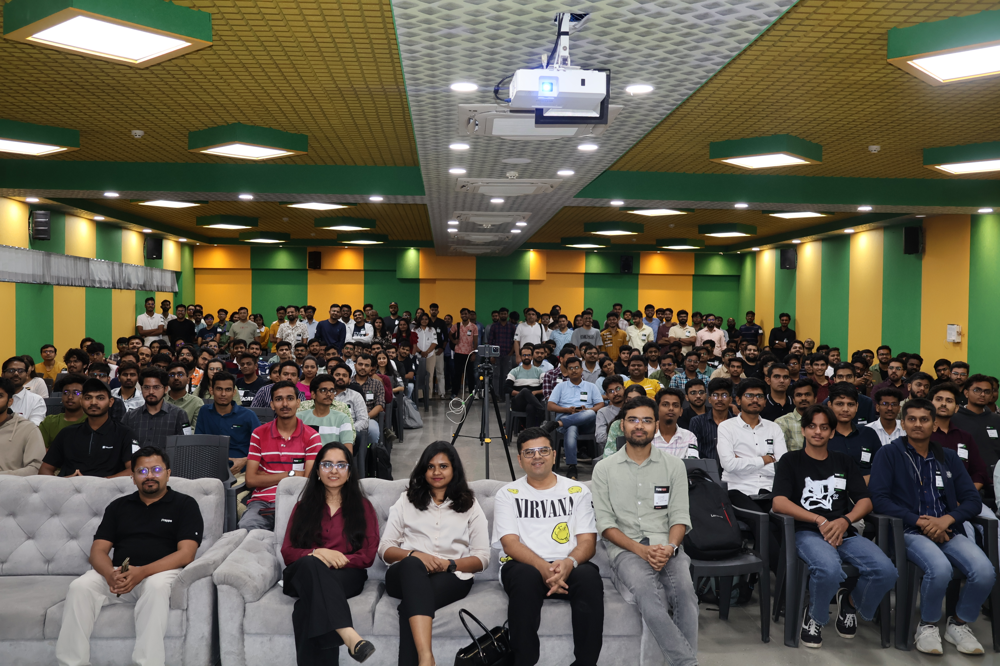

FOSS x Public Policy Virtual Reading Groups - A small but growing group of people from the FOSS United community are interested in discussing the intersection of FOSS & Digital Commons and Public Policy. The scholarship that we offer to active contributors to pursue the Takshashila Institution GCPP (Tech Policy) since September 2022 has contributed to piquing interest in this area. After the Policy devroom at IndiaFOSS 2025, we started the virtual reading group to enable regular discussions on this topic. Three sessions have been organised so far

- The 2015 Policy on Adoption of OSS by Govt. of India
- DPDPA
- Right to Repair

Apart from events that we organized, we worked with or promoted the following events and communities to help them reach a larger audience

- conf.kde.in 2025
- JSLovers Chennai, Namma Flutter Chennai
- Namma Flutter, Coimbatore
- BangPypers, Bengaluru
- CIT Coimbatore
- FSF 40 Event
- TOSSConf
- Debian Trixie Release Party

### FOSS in Academia
We continue our collaboration on the "Software Development using Open Source" course taught by
Prof. Pankaj Jalote at IIIT D. In 2025, Prashant Udupa and his project, Scrite, selected two student teams
to work on Scrite-specific projects as part of their course work. After course completion, we
yet again received good feedback - from the students, the teacher, and the project maintainer - about
this approach. We will continue working with Prof. Pankaj in the future, and we hope to extend this
approach to other colleges teaching software engineering courses.

### Improving an understanding of Tech Policy for FOSS developers

The Foundation continues to offer scholarships for FOSS developers to pursue the Graduate
Certificate in Public Policy (Tech Policy) course by the Takshashila Institution. At IndiaFOSS 2025,
more than a handful of the scholarship recipients came together during a Birds of a Feather session to discuss their experience with the 
program, and uninamously noted that FOSS United should continue providing the scholarship to
worthy applicants.

But we have also consistently observed that at least a few scholarship recipents are unable to
complete the course, for instance, they aren't able to submit the final assignment submission on
time. When we dug further, we realized that some of the recipients underestimated the time and
energy necessary to pursue the course, especially alongside a demanding job. We also realized
that the course wasn't well suited for early-career professionals, e.g., people who are one or
two years into their job. This is because their world-view lacks nuance, which unfortunately
only comes with time and experience.

When looking for ways to support early-career FOSS developers, we came across the Policy in Action Program (PAP) by
Young Leaders for Active Citizenship (YLAC). Ansh Arora from the team pursued the course, and noted that
the course was well suited for early career professionals, and that the shorter duration also made
it easier for someone to commit to the course. We have now started offering scholarships for FOSS
developers to pursue the PAP program as well, and we are actively trying to steer FOSS developers to
either of the courses, depending on their experience.

### IndiaFOSS

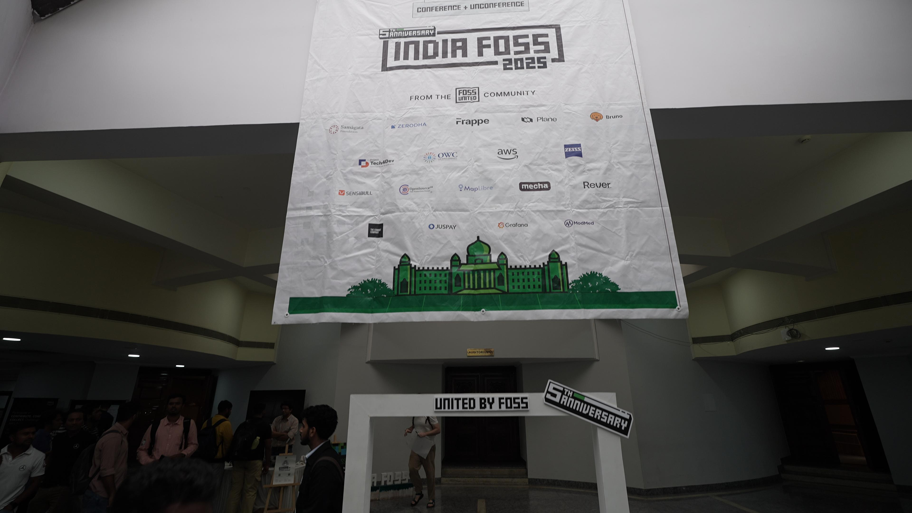

Every year, we feel like IndiaFOSS can't get any better, and yet, somehow it does.
IndiaFOSS 2025 had more than 60 sessions in the main track, with almost 50
additional sessions across 6 devrooms, 60 booths across software, hardware, data,
policy, wiki, student communities, and commercial FOSS projects. 2500+ people bought
tickets to the event, including 82 people who bought a "Contributor Tier" ticket to
support the conference.

||||
|--|--|--|
|Android Open Source Project (AOSP) (8 sessions)|Compilers, Programming Languages, and Systems(7 sessions)|FOSS in Science(12 sessions)|
|Geopolitics and Policy in FOSS(7 sessions)|Open Data(9 sessions)|Open Hardware(6 sessions)|

|||||
|--|--|--|--|
|Absurd Industries|Cloud Cubes|Maker Brains|pcb cupid|
|Build for Bharat Fellowship|CivicDataLab|Digital Futures Lab|Inidx Wikimedia Developers/MediaWiki|
|ISDM DataSights|Mesquite Mocap|Open Invention Network|OpenStreetMap India|
|Pratham Books' StoryWeaver|Samaaj Data Collective|SFLC.in|Takshashila Institution|
|Tattle|Treemouse|Tech4Good Community|Wikimedians of Kerala User Group|
|Wikisource Reader||||
|AboutCode|FOSSEE|Gardener|India Linux User Groups|
|Inkscape|KDE Community|OASIS|Tinkerspace|
|Ubuntu India|
|CircuitVerse|devb.io|dwani.ai|Eventyay|
|exosphere|Flatcar Container Linux|GoFr|k0rdent|
|KubeArmor|Prav|Regolith Linux|Rethink DNS + Firewall|
|StratOS Linux|Zasper|||
|Curium|Flexprice Community|Keploy|Kubevela|
|marimo.io|Olake|TestZeus||
|amFOSS|COSH, NITK|FOSSIA|Loopin|
|Xeneva|Mukti|muLearn|Sahayadri Open Source Community
|STACKD|

A sincere thank you to our Diversity Sponsors, who helped make IndiaFOSS accessible
for 67 participants - 59 students and 8 professionals. The group included 33 women,
34 men, 2 participants from the LGBTQIA++ community, and 1 person with a disability.
The scholarship recipients traveled from all over the country - Gorakhpur, Kolkata,
Kishanganj, Bangalore, Pune, Jabalpur, Guntur, Kalamassery, Bhopal, Chennai, Delhi,
Kottayam, Tirur, Mysore, Hyderabad, Nagpur, Kochi, Kilarkarai, Kassaragod,
Ahmedabad, Patna, Aluva, Shrinagar, Bhimpur, Kuddalore, and more!

|||||
|--|--|--|--|
|Mrugesh Mahopatra|Abhijeet Khandagale|Aswin Bhupalam|Shree Kumar|

And we thank our community partners for helping us expand the FOSS ecosystem.

|||||
|--|--|--|--|
|Code4GovTech|FOSS CIT|FOSS Club SSET|FOSS MEC|

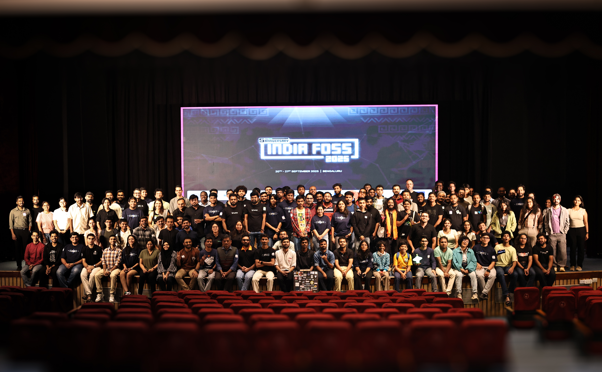

#### Maintainer Summit 2025

A lot of new things happened at IndiaFOSS 2025, but the Maintainer Summit deserves
a special shoutout. Conceptualized by Nemo, and inspired from other unconferences
that he had participated in earlier, the Maintainer Summit brought together
almost 100 FOSS creators and maintainers from across the country, for a day-long
unconference.

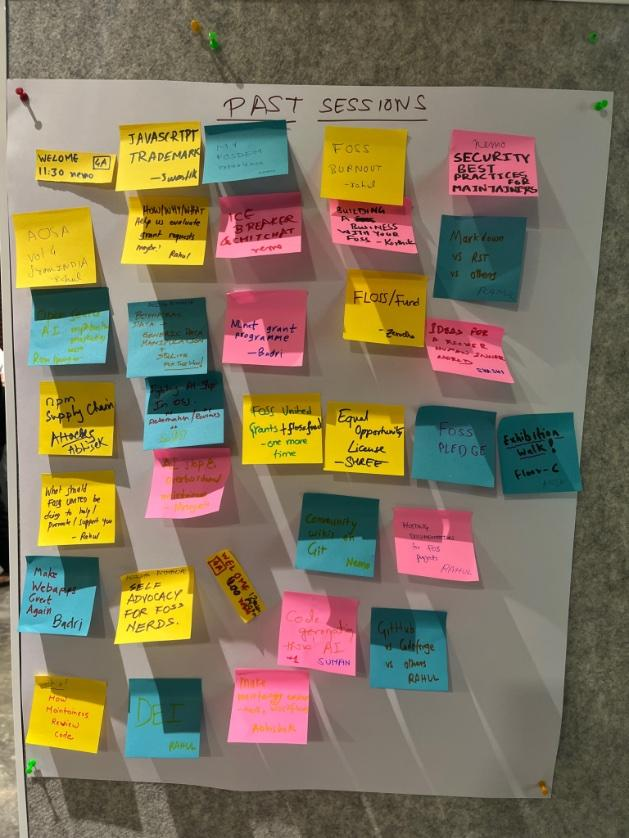

People from Frappe, Pyodide, freeCodeCamp, AboutCode/ScanCode, Inkscape, Alma Linux, OSDAG,
Hoppscotch, Wraft, Keyshade, FLOSS/Fund, Prav, SafeDep, Ente, GitLab, Zaturn,
CircuitVerse, Zasper, Jupyter ecosystem, Rethink DNS + Firewall, CNCF, Kubernetes,
Apache, OWASP, Wikimedia, Hyperswitch, Raven, Linux Kernel, Open Healthcare Network,
and more participated in the event. And they discussed topics ranging from
funding and sustainability in the FOSS ecosystems to AI slop, from supply chain
vulnerabilities and package repositories to self-advocacy for FOSS creators and maintainers,
from business models for FOSS projects to improving the diversity of the FOSS
Indian ecosystem.

The Maintainer Summit was central to our understanding of the needs of the Indian FOSS
ecosystem, and it helped us look beyond surface-level problems and understand deeper
structural challenges. The summit directly impacted our internal restructuring, and
helped us expand from a "Grants" approach to a more holistic "Maintainers"/lifecycle
approach.

### FOSS Hack 2026

The judges were unequivocal after FOSS Hack 2025 - that FOSS Hack needed to change fundamentally.
Participants had easy access to code-generating AI models, and the judges had the difficult task
of sifting through (what we now call) AI slop. And change we did. In 2026, FOSS Hack went from
being a weekend-long hackathon to being a month-long hackathon, and it moved from focusing
exclusively on the code to supporting work across the Digital Commons, i.e., documentation,
testing, security, design, open mapping, and more. Looking at just the numbers, 5000+ participants
registered as 2000+ teams to participate in the event, working across 800 projects in the end,
an improvement from FOSS Hack 2025.

||||
|--|--|--|
|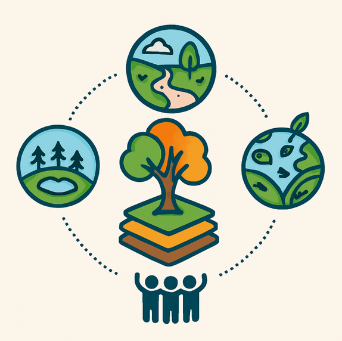|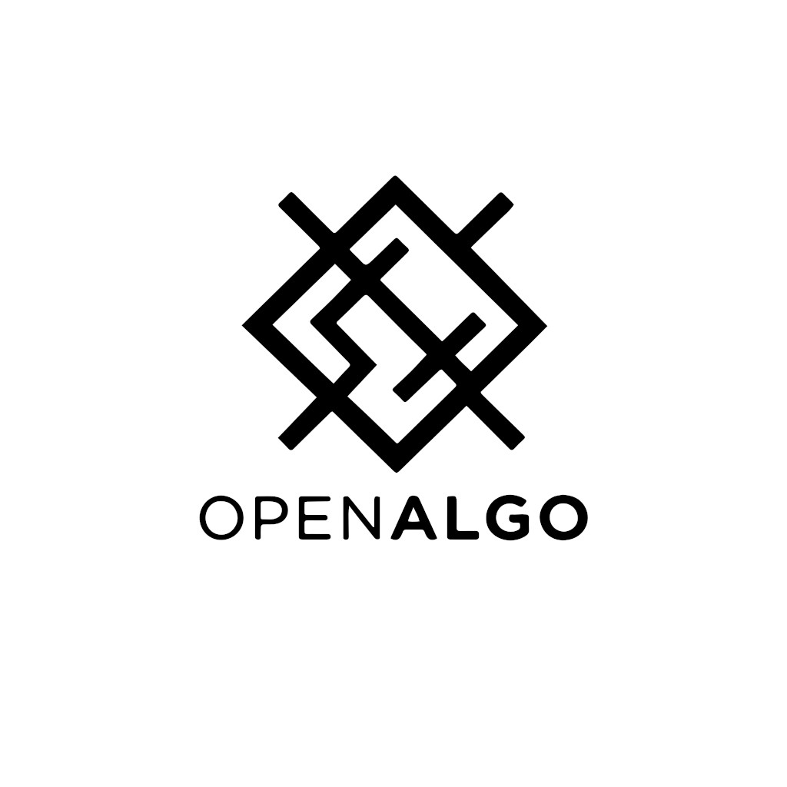||
||||

We also increased the focus on contributing to existing FOSS projects, partnering with 14 FOSS projects/communities, in an attempt to bring new contributors into their ecosystems.

|||||
|--|--|--|--|
|FOSSEE|Rethink DNS|Zasper|Pyodide|
|Maxun|XenevaOS|FOSS United|Hoppscotch|
|OpenAlgo|MapLibre|HOTOSM|CircuitVerse|
|Core Stack|OpenStreetMap|||

To inspire the participants, we organized "Builder Profiles" virtual sessions
with Contrapunctus on Open Stree Mapping, Ramya Raghupathy on MapLibre/HOTOSM,
and Shree Kumar on FOSS & Open Hardware. We organized open community calls during
March to engage the participants regularly, and help address any questions they
have. We were pleasantly surprised when a few of them turned up to demo their
work ahead of the deadline.

And given the focus on building consistently, we selected fewer localhosts than in 2025 (8 vs 10), and worked with them to organize regular events to engage the student
participants.

||||
|--|--|--|
|SRM, KTR Campus, Chennai|Sai University, Chennai|DTU, Delhi|
|KLH University, Hyderabad|GGITS, Jabalpur|Quad AI School of Technology and Management, Patna|
|Siliguri Government Polytechnic, Siliguri|STIST, Trivandrum||

In the end, we disbursed prize money of more than 10 Lakhs INR, of which more than
2 Lakhs INR was disbursed to winners who contributed to existing FOSS projects,
including partner projects.

We thank our community partners for working with us to bring this new vision of
FOSS Hack to life, and for helping us pull it off!

|||||
|--|--|--|--|
|FOSS Clubs|PICT OSS|Absurd Industries|Django India|
|PyDelhi|FOSSEE|BangPypers|OSDC|
|FOSS MEC|SciPy India|DataMeet|FOSSCell NITC|

### India AI Impact Summit

India organised the AI Impact Summit in early 2026, and a lot of communities came together to organise pre- and parallel events. We were involved in a lot of conversations leading up to the summit. We ended up participating in pre-events, organized by Factly and Meta, on “AI in the Public Interest: Local Data, Global Impact”. We also organised a pre-event in collaboration with Viswam AI, SFLC.in, and Linux Foundation India at IIIT H, on Harnessing Open Source AI. At the pre-event, we discussed policy barriers to institutional and government adoption of Open Source AI, and challenges related to Open Datasets that are used to build generative AI models. Viswam AI, Swecha, and SFLC.in opened consultation on a new data license at the event that aims to bring the copyleft licensing regime with software to Open Data.

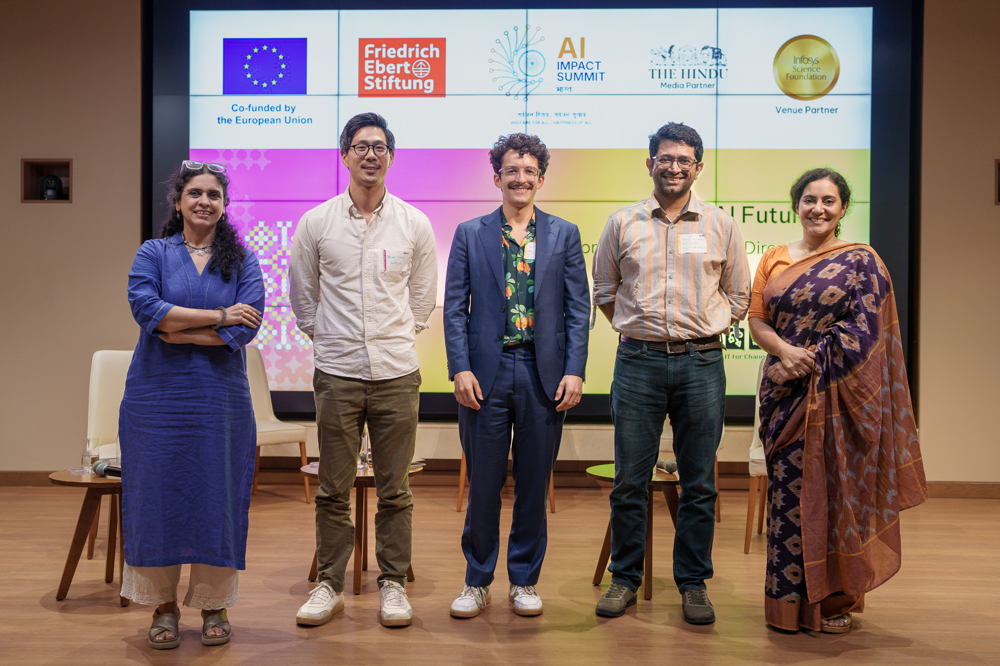

#### Future of Open Source AI with Mozilla

Interestingly, we also got the opportunity to organise an event with Mozilla on Open Source AI. Mozilla Foundation CTO Raffi and Mozilla.ai CEO John were in India for the AI Impact Summit, but they were interested in organising an event in Bengaluru to get a better sense of what's happening on the ground with Open Source AI in India. One of our industry partners put us in touch with them in November, and we organised a half-day event around Open Source AI. It was a mixed-format event that included invited short talks from six speakers and an unconference.

- Dev, CTO of Gooey.ai, spoke about the newly open-sourced Gooey.ai platform and how it could be used to evaluate and understand model capabilities and help avoid vendor lock-in
- Chandra from IT for Change spoke about their work building small models running on off-the-shelf Android smartphones that were being used to evaluate school students' speaking skills
- Amrithesh from Ente discussed building image recognition models that Ente uses to identify people in a photo library, models that run on-device instead of running on the cloud
- Nirzaree from CoRE Stack talked about Open Source AI in Climate and Conservation
- Karthik showcased his project Zaturn, built to address personal problems that he repeatedly faced as a freelance data consultant
- Anwesha from the Takshashila Institution talked about the data centre policy landscape in India.

During the unconference, the participants split up into groups to discuss Open Source AI in the context of Education, Climate, and Local AI, where each discussion was led by one or more of the speakers.

We ended the event with a fireside-style chat with Raffi, CTO of the Mozilla Foundation, and John, CEO of Mozilla.ai. Raffi and John candidly answered questions about how they perceive Open Source AI, what the role of Mozilla is in this new AI age, and related challenges and opportunities.

- Harnessing Open Source AI (Official IndiaAI Impact Summit pre-event)
- Future of Open Source AI with Mozilla

## Maintainers Program

FOSS United Foundation has been disbursing grants to deserving individuals, communities, and organisations since our inception in 2020. But the grant-giving was ad-hoc, and we started overhauling it in 2025. We started by dramatically expanding the budget for Grants - 25 lakh INR - and by speaking about our grants publicly. We also acknowledged that the grant-giving process was not binary - that it was not a simple yes or no. Most conversations with potential grantees, in fact, started with conversations about different levels of support that they could seek - starting with small infrastructure grants to cover their server costs, to small internship grants to cover summer student contributors, to fellowships that enable people to work on a project part-time, to large grants that support creators to work on a project full-time. Unfortunately, educated conversations about sustainability in the FOSS space are few and far between, and there is little to no information publicly available about different levels of financial support that our community members need.

Below, you will see projects, events, and fellowships that we financially supported in 2025, but we realised during the year that grants were not a program in themselves, but that grants were part of a larger program. As we talked to potential and existing grantees, we realised that the financial support only solved one of the problems - and that they still needed support to manage their project, gain and retain contributors, discover new users, UI/UX feedback, and more! And this is how the Maintainers Program came about - to fund, nurture, and support the individuals who provide care to the FOSS & Digital Commons ecosystems.

In 2025, we also became ecosystem partners for the [FLOSS/Fund](https://floss.fund/). As ecosystem partners, we were helping spread the word about FLOSS/Fund, and also with evaluating grant applications for the FLOSS/Fund.

For the full list of project grants by FOSS United in 2025, please see Appendix-C.

### CircuitVerse
What started as a message on Telegram turned into an infrastructure grant for the CircuitVerse project. Born out of IIIT B, CircuitVerse is a teaching tool designed for use in the higher education sector. The maintainers held stable jobs, and weren't interested in financial support to work on the project, but their server bills had started piling up, and were bring covered by individuals on the project. We offered them an infrastructure grant, which fit their needs, and helped us expand the imagination of funding in the FOSS ecosystem.

### Supporting the Nagarathna Memorial Grant by Thejesh G N
We quickly realised a problem with the Maintainers Program - the people who reached out to us already knew about us - and we weren't doing anything to ensure that we're supporting people who don't know us, and will likely never reach out to us directly. This could be because we aren't a known entity in their part of the Digital Commons, or that we aren't an "authority figure" in their part of the Digital Commons. The solution to this problem isn't to expand to every part of the Digital Commons, but rather to support the people who are already actively supporting people in these niches. And Thejesh is one such person.

If you don't know, Thejesh is one of the founders of the DataMeet community, an OG Data community and conference that happened in Bengaluru pre-pandemic. The community is still active, but it is primarily virtual. And we got to know that Thejesh has been running a micro-grants program, the Nagarathna Memorial Grant, to support projects in the Open Data and FOSS ecosystems. We dug a little further and came across Friends of the NMG Grant, people who put money into the grant pool. It was a no-brainer for us to become a Friend of the NMG Grant.

We are calling this the Lighthouse model - people like Thejesh are lighthouses in their respective niches of the Digital Commons. They have a natural gravity, and they have built up trust and reputation in their ecosystem thanks to their long-standing work. We are now trying to discover more Lighthouses and work with them to support their niches.

### Indian FOSS projects at FOSDEM
In case you didn't know, FOSDEM is the largest FOSS gathering in the world, held annually in Belgium. One of the FOSDEM volunteers was invited to speak at IndiaFOSS, and our booth applications at FOSDEM were accepted - one for the FOSS United Foundation and another for the FLOSS/Fund. International travel is a big deal for people But it is also a significant financial burden on an organisation, especially on a not-for-profit foundation. So we decided to experiment with something different at our first presence at FOSDEM - we decided to have community members represent us instead of being present at the booth ourselves.

A few things worked in our favour in this regard - Murtaza and Hussain, creators of Rethink DNS, were speaking at one of the FOSDEM devrooms, and Prasun, creator of Zasper, was speaking at another FOSDEM devroom. In addition, a few members of the Mecha team were also planning on participating in Mecha and were organising a parallel event during FOSDEM. Finally, one of our Governing Board members, Nemo, was coincidentally in Germany during the event, and intended to participate in the event. So, we came up with a plan - we would support members of the FOSS United Community to represent us at FOSDEM, and we would partially support their travel and stay. And Nemo, as a representative of the community, would coordinate.

In the end, this turned out well - FOSS United, community members, and FOSDEM happy with the experiment. FOSS United aims to promote and support the FOSS ecosystem in India - there wasn't a clear reason for us to be at FOSDEM, so we were incredibly happy to support our ecosystem to showcase their work on an international stage.

### Events

Of the event grants that we supported in 2025, we would like to highlight a select few. For the full list, please see Appendix-D.

L3E (Libre, Linux, and LaTeX in Education) - It's not often that a faculty member reaches out to us and expresses interest in organising an event to promote LaTeX in their department. So, when we heard from Prof. Sreekanth VK at the Dept of Management Studies, NITC, we immediately said yes. We need hundreds, if not thousands, of such faculty who are doing their bit to evangelise and enable adoption of Linux and LaTeX on the college campus, and spread the Libre philosophy further

Devsprint at MEC Kochi deserves special praise - this is a one-of-a-kind event organised by a student FOSS club to onboard new contributors to FOSS projects, with support from club/college alumni with experience in FOSS projects. FOSS MEC has consistently brought new contributors into the Indian FOSS ecosystem. and their work deserves broader recognition.

As a topical hackathon that focused on building for “Defending Digital Rights”, you wouldn't expect a lot of students to participate in the SFLC.in hackathon. In the end, when we got to evaluate the submissions to help decide on the winners, we were pleasantly blown away by the number of participants and the breadth of solutions that they built! The SFLC.in hackathon made it clear to us that topical hackathons have a small but interested student community

Prashant and the ADCx team are working to bring together the Audio Developer community in India, and the FOSS ecosystem within. We are excited to see this new community pop up in India, and are happy to support them.

### Fellowships

Below, you will find a select few fellowships provided by FOSS United in 2025. For a full list of fellowships supported in 2025, please see Appendix-E.

Of the 2025 fellowship recipients, Advay and Aarav deserve a special shout-out. In mid-2025, we came across Scrite and its creator, Prashant Udupa. We pinged him and asked him if he was interested in having a chat with us. He's a FOSS veteran, having worked on building and maintaining FOSS projects for almost two decades. His current project, Scrite, had started receiving a significant amount of media attention as its focus was on screenwriters, and the screenplays for a few award-winning movies were written using Scrite.

In our conversation with Prashant, we asked him to consider speaking at IndiaFOSS, and he mentioned that he and his son had already attended IndiaFOSS; Anand Chitipothu was a close friend, and they had attended IndiaFOSS a few years back. In fact, Advay, his son, was inspired by the 12-year-old Linux contributor at IndiaFOSS that year, so inspired that he started learning and teaching teens Blender. We had a follow-up chat with Advay and asked the father-son duo to consider submitting proposals for an upcoming Bengaluru FOSS United monthly community event

When that went well, and given Advay's interest in teaching people Blender, we proposed that he work on a video series teaching Blender in his mother tongue, Kannada. This was in line with parallel efforts to promote local language FOSS advocacy, and Advay soon jumped on board. He put together a short proposal, involving his friend and co-creator Aarav, and they started putting together introductory videos on Blender. Throughout the almost year-long process, Advay posted updates on the FOSS United forum, and in May 2026, the series was finally made public on YouTube.

Advay continues to advocate for Blender, including organising workshops to teach the basics of Blender

## Campaigns Program

- We started the year with the #MaintainerMay campaign, which culminated in forklore.in and the new #ForkloreFridays  campaign
	- A few maintainers highlighted during the original campaign, and who were included in the new #ForkloreFridays campaign
- IndiaFOSS and FOSS Hack-related advocacy takes up a significant amount of time from the team
	- A few highlights from IndiaFOSS 2025 and FOSS Hack 2026 (advocacy-related)
- License to Learn was conceptualised after IndiaFOSS, and we started filing RTIs towards the end of 2025.
	- Notable numbers from the RTIs and a few unexpected names
	- Notable institutes we filed RTIs with, and their responses
	- Most of the Indian FOSS ecosystem has an academic background in Computer Science. So, when we asked people what they thought colleges spent on software every year, and what was the costliest software they paid for, we usually heard responses in the 10 Lakhs INR order of magnitude and Google Workshop/Microsoft Windows being the costliest software. This is unfortunately an outcome of the narrow focus that most of the Indian education sector had on Computer Science, and the lack of awareness about non-computer science disciplines. We knew that engineering and simulation software such as Matlab, Ansys, and Comsol, were the primary expense items for Engineering colleges, and our realisation that much of the Indian software ecosystem didn't know this pushed us to start this campaign.
	- The first round of RTIs with NITs yielded mixed results - 9 of the NITs responded, with the other 12 rejecting our RTI application or responding with little to no information. But the 9 responses validated our understanding - multiple crores of Rupees were being spent every year on software subscriptions, with close to 70% of the expenditure going towards engineering and simulation software, e.g., Matlab, Comsol, Ansys, AutoCAD, and only 30% spent on administrative software, e.g., Tally, Microsoft Office suite, Google Workspace, Zoom.
	- In late 2025 and early 2026, we filed additional RTIs with IIITs, AIIMS, and IIMs. Please keep an eye on licencetolearn.in for updates.
- Maintainer May - 31 Maintainers in 31 Days https://forum.fossunited.org/t/meet-the-maintainers-31-days-31-foss-maintainers-from-india/5651
	- In late 2024, I started putting together a list of FOSS projects that were created in or maintained from India, and without using a search engine, I was able to put together a 100+
	- In 2025, I started asking software developers if they could name FOSS projects that were created or maintained in India, or if they could name Indians who were maintaining or creating FOSS projects from India. Unfortunately, most of the people I asked could only name one or two projects or individuals. Even in the best case scenario, people named a handful (5-10) projects or people, but not more.
	- Why is this a problem? Because this is unfortunately indicative of the cultural perception of FOSS in India. Most Indian software developers are indifferent to the FOSS that our work is built on top of. If you can't name FOSS projects that you use, or if you can't name who maintains or who created those projects, you mostly likely don't care about the sustainability of the projects either.
	- Worse, this limits the imagination of the Indian software development ecosystem. Every year, we run into thousands of students and early career professionals who express interest in contributing to FOSS, but they can't name more than one or two FOSS projects that they rely upon, directly or indirectly. And the few people that know a thing or two about FOSS projects and maintainers/creators, their role models are almost exclusively westerners.
	- With #MaintainerMay and Forklore, we wanted to change these perceptions. So we deliberately made a few decisions
		- the maintainers/creators come first, not the projects. This was because other listicles have been created in the past, for instance by GitHub, but the focus is usually on the projects from India. And it's not immediately obvious from a GitHub project who created it or who maintains it
		- limit the listicle to only include maintainers and creators who were in India, not Indians who are involved in FOSS work outside of India. This is because we wanted to demonstrate that world-class FOSS work was bring produced from India
		- finally, we added a few questions to make the people relatable, to hopefully convey the fact that there isn't anything mythical about FOSS creators and maintainers
- https://forklore.in/ and #ForkloreFridays throughout the rest of the year
- local language FOSS advovacy https://fossunited.org/blog/community/we-started-talking-about-foss-in-tamil-and-things-got-interesting
- https://licencetolearn.in/

### Rise of FOSS in India report launch event

To celebrate the launch of the ["Rise of FOSS in India" report](https://www.nls.ac.in/news-events/nlsiu-releases-report-on-the-rise-of-foss-in-india/), we organised a day-long event to shine a light on the findings of the report and to bring together the organisations that participated in the case studies to share their learning with each other. The event was organised at IIIT Delhi, with support from Prof. Pankaj Jalote, Founding Director. Four panel discussions on the Strategic Importance of FOSS for India, Role of FOSS in India's BFSI Sector, Role of FOSS in Indian IT, and Education Sector & FOSS shined a light on the finding from the report.

Prof. Arul George Scaria, NLSIU, and Prof. Pankaj Jalote, Founding Director and
Distinguished Professor, IIITD provided welcome remarks at the beginning of the event.
Shri Abhishek Singh, DG NIC & Additional Secretary, MeitY; Government of India shared a virtual talk
highlighting the importance of FOSS.

The Panel discussion on the Strategic Importance of FOSS for India was moderated by Venkatesh Hariharan, India Representative, Open Invention Network, with the following panelists - Renuka Sane, MD Trustbridge, Jaijit Bhattacharya, President, Center for Digital Economy and Policy, Parminder Singh, Independent Researcher; Poruri Sai Rahul, CEO, FOSS United Foundation

Prof. Suryaprakash Mishra, Associate Professor, NLSIU moderated the panel discusison on the Role of FOSS in India's BFSI Sector, with Sairee Chahal, Founder, Mahila Money; Sushil Kurri, CTO, PocketATM; Shuvam Misra, Founder Chairman, Remiges; and Vishnu Sudhakaran, Engineer, Zerodha as the panelists.

The Role of FOSS in Indian IT panel discussion was moderated by Retired Prof. Rahul De, Independent Consultant, Retired professor & Dean, IIM Bangalore, with a panel composed of Akhila Somanath, Co-founder and COO, Tech4GoodCommunity, Kishore Bhargava, CEO, LinkAxis & Open Source veteran, and Vineet Dahiya, Director & Promoter, InfoAxon.

Finally, Poruri Sai Rahul, CEO, FOSS United Foundation moderated the panel discussion on Education Sector & FOSS, with Prof. Shobha Tyagi, MRIIRS, Karkee U, Founder of Villipuram GNU Linux User Community, and Prof. Vigneswara Ilavarasan, IIT Delhi as panelists.

## Enabling functions

### Diversity, Equity, and Inclusion

It's no surprise that there is little to no gender diversity in the software ecosystem,
let alone the FOSS ecosystem. Apart from gender, diversity in academic background, in
geographic location, and so on, are also a systemic issue in the tech sector. Last year,
we chose to expand the scope of our diversity efforts to go beyond only gender diversity.
This was not because the gender diversity problem was "solved", it was because we needed
more breathing room to see results, in the short-term and in the long-term.

Apart from Diversity Scholarships at IndiaFOSS 2025, our effort to improve vernacular
FOSS advocacy are worth calling out here. After ChennaiFOSS 2024, we slowly observed
an ever increasing discourse about FOSS in the Tamil language by the Chennai tech
ecosystem. The discourse didn't just stop with YouTubers - the Chennai tech ecosystem,
including the FOSS United Chennai community, organized the first ever
Tamil Open Source Software Conference, i.e., TOSSConf, in Chennai last year! It's the
first tech conference in our awareness where the primary language for communication
during the event wasn't English. Along the same lines, it's worth calling out Advays' and Aaravs'
efforts to advocate for Blender in Kannada, supported by a FOSS United grant.

It took a few years, but it has become abundantly clear to us that DEI work is,
and needs to be treated as, an enabler across the organization. But we are yet to meaningfully
incorporate DEI work across the breadth of work at FOSS United, let alone articulate
and achieve the goals we had for the Diversity Scholarships program at IndiaFOSS in the
first place. Our efforts to find long-term partners to work on improving diversity
have also been in vain, since most diversity scholarship recipients don't continue
engaging with the FOSS ecosystem after the event, as far as we are aware.

Over the coming year, we will layout the goals of our diversity work, evaluation rubrics
for the success or failure of our diversity work across the breadth of FOSS United initiatives,
and ensure that diversity is treated as an org-wide effort.

### Tech

Apart from regular upkeep and maintenance of the code and infrastructure behind
fossunited.org, the tech team mostly focused design-related changes to various
FOSS United pages, for instance, FOSS Hack 2026. The team also continues to maintain
the tech infrastructure that the FOSS United community has come to rely on, for instance,
Jitsi Meet for internal and open community calls, listmonk for newsletters, and so on.
For a complete understanding of the FOSS that we rely upon, both for fossunited.org
and other websites, and for internal team infrastructure, please see the
[FOSS United stack page](https://fossunited.org/stack).

While the software powering fossunited.org is FOSS, we only get a handful of contributions,
and almost all of the contributions are fly-by in nature. The advent of code-generating
AI has reduced the barrier for contribution, but it appears we have a long way
to go before we become a FOSS project that is not only open-source but is also
built and maintained by the FOSS United Community, and not just by the team.
Volunteers use the platform a few times a month, so volunteers are best suited
to comment on what is needed and what isn't. Over the coming year, we will
attempt to better understand what we can do to improve contributions to the
codebase..

Additionally, while the software is FOSS, there are no other users of the software,
as far as we are aware. And this isn't because there isn't a need for an event management
software - at least a few times an year, we come across people who built an event management
software from scratch, or people who are looking for a FOSS alternative only to end up
eventually on Luma. The FOSS United codebase has a long way to go before it's truly a
general purpose event management software, at least as far as the needs of a FOSS community
are. We intend to address this over the coming year - not because we want to become one more
general purpose event management software, but because it's almost good enough to solve the
needs of the people that reach out to us asking for solutions.

## Governing Board

After a long 2024, the FOSS United Community elected our first ever Governing Board. Starting April
2025, five Governing Board members started interacting with the Foundation regularly to better 
understand and shape the long-term vision of FOSS United. Bodhish Thomas, Bowrna Prabhakaran, Nemo,
Shree Kumar, and Swastik Banarwal spent time over the past year discussing long-term strategy,
funding, annual budgets, Working Groups, and more.

Please find additional information about the Governing Board on this [blog post](https://fossunited.org/blog/organization/meet-the-first-ever-elected-community-governance-board-foss-united). For minutes from the Governing Board meetings, please see the [Organization category](https://fossunited.org/blog/organization) in the FOSS United blog.

## FOSS United Foundation Staff

After helping establish the Foundation over these many years, Vishal is moving on to do what he does best - building communities from scratch. After grasping the situation in Bihar, his home state, he decided to launch a new community to improve the software and tech ecosystem in Bihar, named [Bodhya](https://bodhya.net). Vishal continues to be on our Board of Directors, and continues to help with backoffice work, e.g., finances. He stepped away from the day-to-day but continues to be involved in all of the key decisions.

Siddharth Shivkumar joined the Learners Program as a Program Manager, taking over duties from Vishal. He has been a long-time volunteer with the Foundation, and most recently, he was one of the co-chairs of IndiaFOSS 2025. Earlier, he was also one of the Tech+Policy scholars who pursued the GCPP (Tech Policy) course by the Takshashila Institution.

After Harsh moved on from the Tech team, Dilip took his place. Arya K and Aarav also worked as Tech Interns briefly, working on improving Open Graph Image generation and the End Software Patents India website respectively. Antara finished her internship with the Design team, and Muneer started as a Design intern.

Syeda interned and worked as a Business Analyst, helping setup dashboards, on Desk and Frappe Insights, to help us better visualize and contextualize activity in the FOSS United Community.

## Finances

|Statement of income and expenditure|Amount|
|--|--|
|Total income|2,92,73,590 INR|
|Total expenses|2,39,00,070 INR|
|Surplus|5,373,520 INR|

* The surplus amount above was moved into a Fixed Deposit

|Income|Amount|
|---|---|
|CSR income|1,12,21,670 INR|
|Total Donations|1,03,35,670 INR|
|Income from events|75,93,940 INR|
|Total|2,91,51,270 INR|

* "Donations" above is total donation received from Samagata Foundation

|CSR Income|Amount|
|---|---|
|Zerodha|88,71,670 INR|
|Sensibull|10,00,000 INR|
|Frappe|6,00,000 INR|
|The Commit Company|5,00,000 INR|
|Azim Premji Foundation|2,50,000 INR|
|Total CSR Income|1,12,21,670 INR|

* Please also see "Frappe" under IndiaFOSS 2025 income to get a full picture of financial contribution from Frappe

|IndiaFOSS 2025 income|Amount|
|--|--|
|Frappe|24,00,000 INR|
|Zeiss|5,00,000 INR|
|AWS|5,00,000 INR|
|Ticket sales (Student)|3,29,175 INR|
|Ticket sales (General)|4,50,636 INR|
|Ticket sales (Late bird)|2,05,200 INR|
|Ticket sales (Regular)|4,56,000 INR|
|Ticket sales (Contributor)|4,10,000 INR|
|Plane|2,50,000 INR|
|Bruno|2,50,000 INR|
|Project Tech4Dev|2,50,000 INR|
|One World Community|2,50,000 INR|
|Opensource DB|1,25,000 INR|
|MapLibre|1,25,000 INR|
|Rever|1,25,000 INR|
|Mecha|1,25,000 INR|
|Juspay|1,00,000 INR|
|Modmed|1,00,000 INR|
|Grafana|1,00,000 INR|
|Total|70,51,011 INR|

* IndiaFOSS 2025 income counts towards the "Income from events" heading under Revenue

|Total Expenses|Amount|
|--|--|
|Employee Benefit Expense|1,02,53,410 INR|
|Depreciation and amortisation|2,25,760 INR|
|Other Expenses|1,34,20,890 INR|
|Total|2,39,00,070 INR|

* "Depreciation and amortisation" accounts for depreciation of the value of "Computers and Accessories", "Office Equipments", "Furniture and Fixture", and "Mobile Phones" owned by the Foundation

|Employee Benefit Expense|Amount|
|--|--|
|Salary and wages|1,02,42,400 INR|
|Staff welfare|11,010 INR|
|Total|1,02,53,410 INR|

* "Salary and wages" includes CEO pay of 30,00,000 INR so 72,42,400 INR amounts to remaining staff salary

|Other Expenses|Amount|
|--|--|
|Events Related Expenses|64,72,710 INR|
|Audit Fees|75,000 INR|
|Contribution and Grants|32,63,080 INR|
|Professional Fees|5,43,910 INR|
|GST Expenses|6,50,410 INR|
|Travel Expenses|14,59,300 INR|
|Miscellaneous Expenses|3,15,510 INR|
|Print and Stationary|1,68,850 INR|
|Razorpay Service Charges|1,01,560 INR|
|Server Charges|1,47,380 INR|
|Domain Registration|1,67,000 INR|
|Marketing Expenses|56,190 INR|
|Total|1,34,20,890 INR|

* "Event Related Expenses" above mostly includes IndiaFOSS 2025 expenditure of 47,96,737 INR
* "Contribution and Grants" above mostly includes project grants, event grants, and fellowships. For detailed information, see Appendix-C, Appendix-D, and Appendix-E
* "Travel Expenses" above includes staff travel and stay-related expenditure for events, including FOSS United events
* "Professional Fees" above mostly includes accounting charges
* "Print and Stationary" above includes event-related printing
* "Server Charges" above is mostly monthly bills for Linode servers
* "Domain Registration" above includes AWS monthly bills and (incorrectly) Linux Foundation India event tickets
* "Marketing Expenses" above includes Google Workspace subscription and FOSS United event goodies (stickers and other swag)

### Talks and podcasts by FOSS United Foundation staff

||||
|---|---|---|
|[Code of the Commons, All Things Policy podcast by The Takshashila Institution](https://youtu.be/RZ52KLRkRZw?si=qoSiaYC1oIGEEiuw)|[Open-Source Trends and Challenges for the Communities in India panel discussion, Open Source Week by SFLC.in](https://www.youtube.com/live/NnbaLSf6qNE?si=L7e0oecBOxI0SlFj)|[Public-by-Design - Ensuring Open-Source and Community-Driven DPI panel discussion, DPI in Conversation](https://www.youtube.com/live/McSw4VxCunk?si=kVGxgMqpM-LGx_VP)|
|[FOSS in the Digital Knowledge Commons, Future of Commons collective](https://www.youtube.com/live/Sl_vwnxWdK8?si=_yEgDrudGAjHv41_)|[Why builders choose Open Source, AIM Tech Talks](https://youtu.be/p9RHRrPWk-0?si=ilPQOs_w4_AhDO-M)|[India's path to digital independence panel discussion, Civo Navigate India](https://youtu.be/gk2pfuy8bK8?si=lOVmuBuWHKUxWEkD)|
|[Why Big Tech Needs Open Source podcast, ACE Engineering College](https://youtu.be/CuRhWxEMQ8w?si=c910FgxJKaKbaOMN)|[Embracing FOSS in EdTech,  KDE Conf India](https://conf.kde.org/event/8/contributions/239/)|[Strengthening India's FOSS Community, Ansh Arora, OpenSearchCon India](https://youtu.be/1Z51JKQjlc0?si=LiAWls56oM6IY9XB)|
|[Learnings from a $1M discovery and funding experiment, FOSSAsia Summit 2026](https://m.youtube.com/watch?v=XAaiJ25aT-Y&feature=youtu.be)|[FOSS in Education at OpenSUSE Asia](https://events.opensuse.org/conferences/oSAS25)|[Significance of Open Source Projects and its sustainability, Open Source Day 2025](https://osd.opensourceweekend.org/2025/)|
|[Embracing FOSS in Education Technology, Critical Studies of Education and Technology 2025](https://youtu.be/8jUExY24CHg?si=Kj-hfYgwMiGwVU9r)|[Forking around and Finding out, Developer Skill Development Program India 2025](https://meta.wikimedia.org/wiki/Developer_Skill_Development_Program_India_2025)||

### Coverage of our work in major Indian media outlets, op-eds by staff, and quotes

||||
|---|---|---|
|[Indian open source ventures take on Google Photos, SAP, Times of India](https://timesofindia.indiatimes.com/technology/times-techies/indian-open-source-ventures-take-on-google-photos-sap/articleshow/124081082.cms)|[Arattai vs WhatsApp: The answer to Western Big Tech is not Indian Big Tech, Opinion, Indian Express](https://indianexpress.com/article/opinion/columns/arattai-vs-whatsapp-the-answer-to-western-big-tech-10299424/)|[Open source does not mean open to vulnerabilities, Opinion, The Hindu](https://www.thehindu.com/opinion/op-ed/open-source-does-not-mean-open-to-vulnerabilities/article70271678.ece)|
|[Experts decode hyper around Gen AI by The Hindu](https://www.thehindu.com/news/cities/bangalore/experts-decode-hype-around-gen-ai/article70226652.ece)|[Free code can build India's AI fortune, Make India Competitive Again newsletter, The Ken](https://the-ken.com/newsletter/make-india-competitive-again/free-code-can-build-indias-ai-fortune/)|[Google to Ban Android APK Sideloading, Sparking Criticism Over User Choice and Developer Freedom](https://www.medianama.com/2025/08/223-google-blocks-android-apk-sideloading-2026/)|
|[Young, skilled and floundering: Overcoming the hope gap in careers today, 90,000 Hours podcast, The Ken](https://the-ken.com/podcasts/90000-hours/young-skilled-and-floundering-overcoming-the-hope-gap/)|

#### Appendix - A

Notable active FOSS United communities during 2025

||||
|--|--|--|
||||
||||
||||
||||

- A total of 367 events were organized by the FOSS United Foundation and the Community
	- 11 in Chennai
	- 9 in Bengaluru
	- 6 in Mangalore
	- 4 in Hyderabad
	- 5 in Delhi
	- 3 in Mumbai
	- 215 FOSS Club events happened
	- 45 hands-on workshops
	- 38 hackathons
	- 25 Linux Install Fests
- A total of 858 proposals were submitted to FOSS United events during 2025, of which 364 proposals were submitted for IndiaFOSS 2025
- 3789 tickets were sold to FOSS United events in 2025, 2310 of which were sold for IndiaFOSS 2025. In addition, 599 tickets were sold for MangaloreFOSS 2025, 127 tickets at LucknowFOSS, and 150 at MumbaiFOSS
- 13,683 participants RSVPd to FOSS United events during FY 2025-26
	- 1859 RSVPs to events in Chennai
	- 365 RSVPs to events in Mangalore
	- 864 RSVPs to events in Bengaluru
	- 770 RSVPs to events in Delhi
	- 554 RSVPs to events in Lucknow
	- 511 RSVPs to events in Hyderabad
	- 193 RSVPs to events in Mumbai
	- 645 RSVPs to events in Pune

#### Appendix - B

Notable active student clubs during 2025

||||
|--|--|--|
|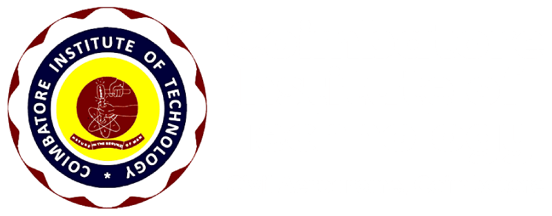|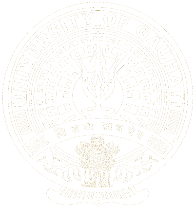|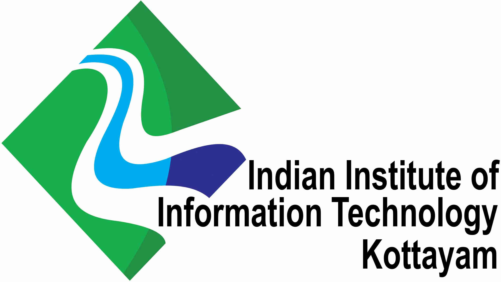|
|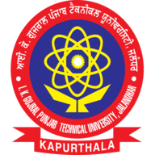|||
||||
|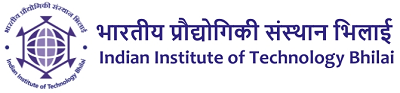|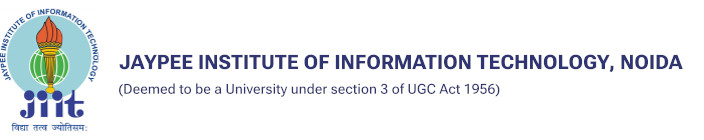||
||||

||||
|--|--|--|
|College of Engineering Vadakara|NIT Srinagar|Mukesh Patel School of Technology Management and Engineering, NMIMS, Mumbai|
|Gyan Ganga Institute of Technology and Services, Jabalpur|Bannari Amman Institute of Technology (BIT), Tamil Nadu|IIT Bhilai|
|SCMS School of Engineering and Technology|PDEA College of Engineering and Managament, Pune|Tatyasaheb Kore Institute of Engineering and Technology, Kolhapur|
|RV University, Bengaluru|Government Engineering College, Sheikhpura|SRM, Kattankulathur|
|Sai University, Chennai|Pondicherry University|Chennai Institute of Technology|
|SRM University, AP|Coimbatore Institute of Technology|Jaypee Institute of Information Technology, Noida|
|St. Thomas Institute for Science and Technology, Thiruvananthapuram|Bennett University, Noida|GEC Thrissur|
|Siliguri Government Polytechnic, Siliguri|Gyan Ganga Institute of Technology and Sciences|Chinmaya Vishwa Vidyapeeth|
|Amal Jyothi College of Engineering|Mar Baselios Christian College of Engineering and Technology|MAMO College|
|MS Ramaiah Institute of Technology|United Institute of Technology|IIIT Kalyani|
|KLH Universty|Kanpur Institute of Technology|Delhi Technical Campus, Noida|
|VIT Chennai|IIIT Kottayam|Christ College of Engineering|
|Amrita Vishwa Vidyapeetham, Amritapuri|Sandip University, Nashik|University School of Automation and Robotics|
|Smt Indira Gandhi College of Engineering|LBS College of Engineering|Gauhati University|
|I K Gujral Public Technical University|Dr. NGP Arts and Science College|Allenhouse Business School|

#### Appendix - C

Project grantees by FOSS United Foundation from 2025

||||
|--|--|--|
|||||

| Project          | Kind           | Total amount |
| ---------------- | -------------- | ------------ |
| CircuitVerse     | Infrastructure | 1,00,000 INR |
| Zasper           | Project        | 4,50,000 INR |
| Malhar           | Project        | 3,00,000 INR |
| FlossbOxIN       | Infrastructure | 30,000 INR   |
| VGLUG Foundation | Community      | 5,00,000 INR |
| Rethink DNS      | Project        | 3,00,000 INR |
| OSVauld          | Project        | 4,00,000 INR |
| Data for India   | Infrastructure | 2,50,000 INR |
| Total            | -              | 23,30,000 INR|

#### Appendix - D

Event grants issued by FOSS United Foundation during 2025

||||
|--|--|--|
|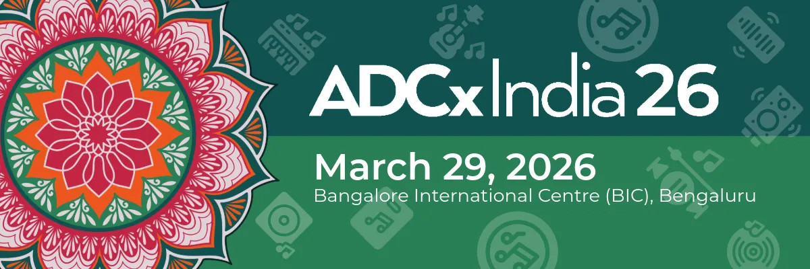||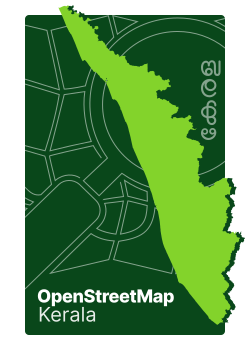|
||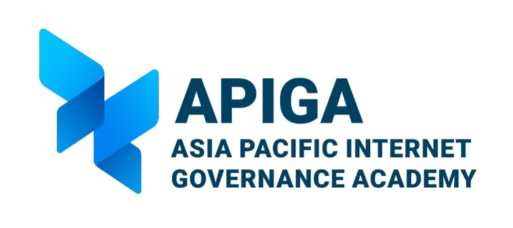|
||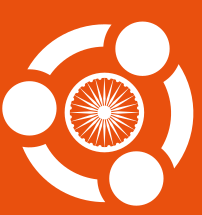|
|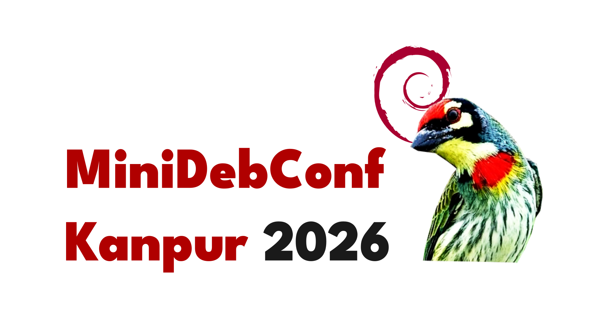|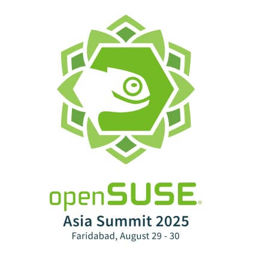||

| Event                        | Organizing community            | Amount |
| ---------------------------- | ------------------------------- | ------ |
| ADCx India 2025              | ADC India                       | 33,000 INR      |
| BarCamp Bangalore 2025       | BarCamp Bangalore               | 50,000 INR      |
| L3E                          | CIRA, NIT Calicut               | 2,500 INR       |
| OSD Hack 2025                | OSDC, JIIT Noida                | 15,000 INR      |
| Linux Diary 6.0              | Walchand College of Engineering | 7,000 INR       |
| OpenSUSE Summit Asia         | OpenSUSE Community              | 20,000 INR      |
| Daydream Jhansi              | Hack Club                       | 5,000 INR       |
| Devsprint                    | FOSS MEC, Kochi                 | 10,000 INR      |
| SFLC.in Hackathon            | SFLC.in                         | 25,000 INR      |
| Ubucon India 2025            | Ubuntu                          | 25,000 INR      |
| State of the Map Kerala 2025 | OSM India                       | 25,000 INR      |
| Anthillhacks                 | Janastu                         | 1,00,000 INR    |
| FOSS4G Asia                  | FOSS4G                          | 8,000 INR       |
| APIGA India                  | APIGA and IIRO                  | 25,000 INR      |
| ADCx India 2026              | ADC India                       | 67,000 INR      |
| MiniDebConf Kanput 2026      | Debian India                    | 20,000 INR      |
| Total                        | -                               | 4,37,500 INR    |

#### Appendix - E

Fellowships supported by FOSS United during 2025

| Name            | Kind                          | Amount |
| --------------- | ----------------------------- | ------ |
| Arpit Tripathi  | NAST                          | 1,20,000 INR |
| Contrapunctus   | Open Street Map India         | 3,60,000 INR |
| Ansh Arora      | YLAC Policy in Action Program | 30,000 INR   |
| Ashutosh Pandey | GCPP                          | 26,400 INR   |
| Barkha Manral   | GCPP                          | 26,400 INR   |
| Anmol Maniyar   | GCPP                          | 26,400 INR   |
| Azan            | GCPP                          | 26,400 INR   |
| Srikanth Doddi  | GCPP                          | 49,560 INR   |
| Agriya Khetarpal| GCPP                          | 49,560 INR   |
| Abhishek Gali   | GCPP                          | 49,560 INR   |
| Sanket Gharat   | CoRE Stack Innovation Challenge| 40,000 INR   |
| Anoop Asranna   | CoRE Stack Innovation Challenge| 40,000 INR   |
| Trishal Kumar   | CoRE Stack Innovation Challenge| 40,000 INR   |
| Advay and Aarav | Blender x Kannada             | 18,000 INR   |
| Prerak Singh    | Season of Commits 2025        | 75,000 INR   |
| Total           | -                             | 9,27,720 INR |

#### Appendix - F
Companies that supported us financially during FY 2025-26

||||
|--|--|--|
|Frappe|Zerodha|Samagata Foundation|
|Sensibull|The Commit Company||
|Mozilla|Mozilla.ai||
|Plane (IndiaFOSS 2025)|Bruno (IndiaFOSS 2025)|Project Tech4Dev (IndiaFOSS 2025)|
|One World Community (IndiaFOSS 2025)|AWS (IndiaFOSS 2025)|Zeiss (IndiaFOSS 2025)|
|OpenSource DB (IndiaFOSS 2025)|MapLibre (IndiaFOSS 2025)|mecha (IndiaFOSS 2025)|
|Rever (IndiaFOSS 2025)|Juspay (IndiaFOSS 2025)|Grafana (IndiaFOSS 2025)|ModMed (IndiaFOSS 2025)|
|CodeRabbit AI (PuneFOSS)|RedHat (PuneFOSS)||
|compossible umwelten (MumbaiFOSS)|skyflo.ai (MumbaiFOSS)||
|ente(in-kind sponsor)|cal.com (in-kind sponsor)||
|MIMA Institute of Management (venue sponsor)|IIIT Lucknow (venue sponsor)|NMIMS (venue partner)|

#### Appendix - G

Notable venue partners for FOSS United events

||||
|--|--|--|
|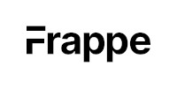|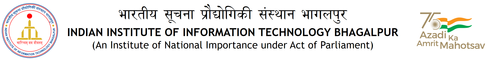|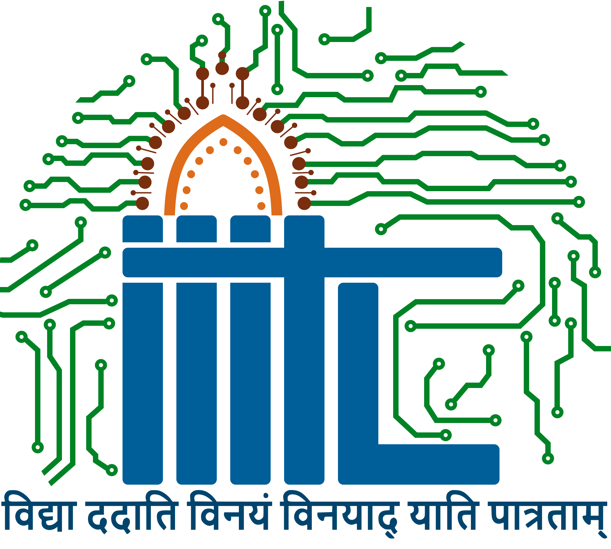|
|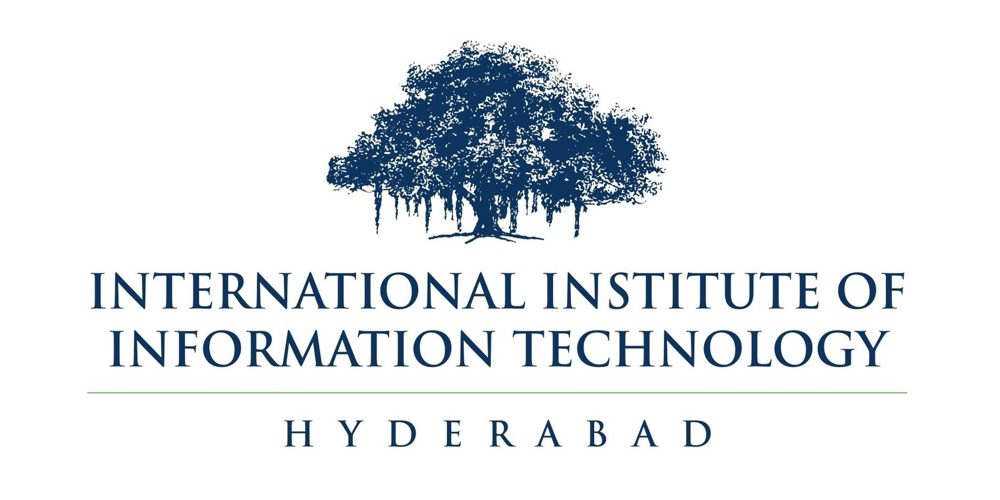|||
||||
||||
||||

||||
|--|--|--|
|MIMA Institute of Management, Pune|NMIMS, Mumbai|Chhatrapati Shahu Ji Maharaj University, Kanpur|
|Freshworks, Chennai|St. Josephs College of Engineering, Chennai|NIT Calicut|
|Thoughtworks, Chennai, Coimbatore|Frappe, Mumbai|NITK Surathkal|
|Remiges Technologies, Mumbai|Dr. Mahalingam College of Engineering and Technology, Coimbatore|Model Engineering College, Kochi|
|Samagata Foundation, Bengaluru|Coimbatore Institute of Technology, Coimbatore|Department of Computer Science, IIT Madras|
|IIIT Lucknow, Lucknow|Internet Freedom Foundation, Delhi|Plane.so, Hyderabad|
|essentia.dev, Delhi|Stacknexus Technologies, Hyderabad|RCC Institute of Information Technology, Kolkata|
|IIIT Bhagalpur|IIIT Hyderabad|InMobi, Lucknow|
|RedHat, Pune|GEC Samastipur|Sam Higginbothom University of Agriculture, Technology, and Science|
|Niveus Solutions, Udupi|Dot Com Infoway, Madurai|Takshashila Institution, Bengaluru|
